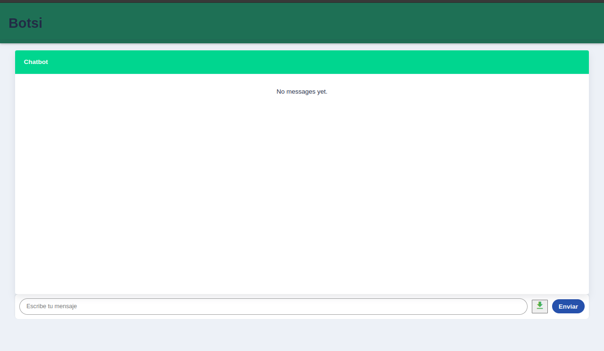
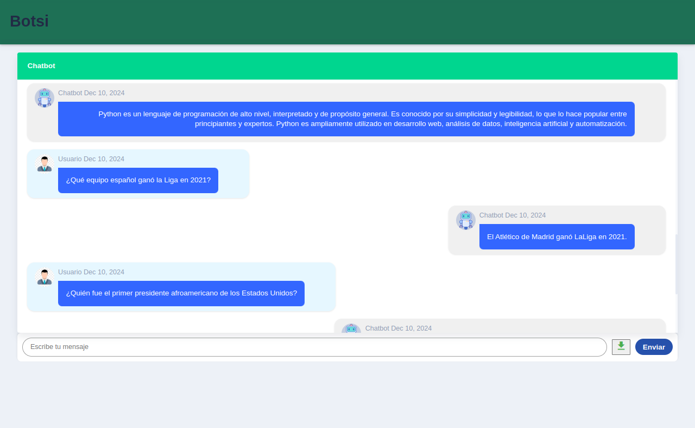
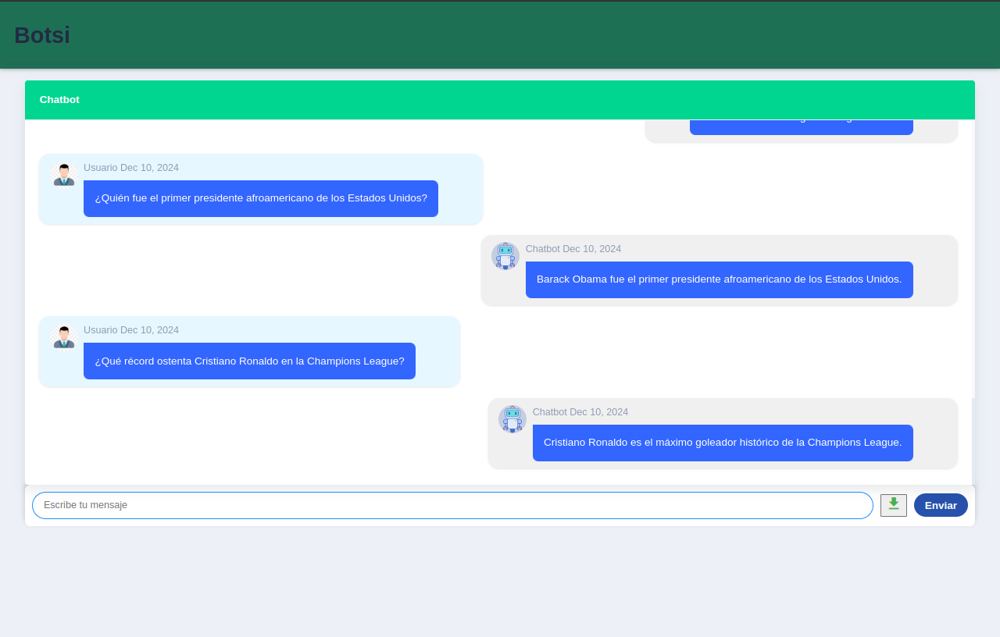

# IA1_Proyecto_10

## **Integrantes**

#### **Grupo 10**

- SUM COYOY, RANDY MARCELINO
- OVALLE DE LEÓN, CARLOS ALEXIS
- GORDILLO GONZÁLEZ , PEDRO RICARDO

## Detalles del proyecto

 Este es un modelo de inteligencia artificial desarrollado con **TensorFlow.js**, el cual se ejecuta directamente en el navegador utilizando el framework **Angular**. Esta combinación permite realizar interactura con el Chatbot de manera eficiente y dinámica, sin necesidad de enviar datos al servidor, mejorando así el rendimiento y la privacidad.

## Manual técnico
[Descargar Manual Técnico](./documentacion/Manual-Tecnico.pdf)

## Manual de usuario
[Descargar Manual de usuario](./documentacion/Manual-de-Usuario.pdf)

[Click aqui para la demostración](https://peter2510.github.io/IA1_Proyecto_10/)

# Ejemplo de entradas
- ¿Cuál es el animal más rápido del mundo?
- cuall es el animal más rápido del mundo?
- ¿Quién escribió Don Quijote?
- ¿Qué es una función en programación?
- ¿Qué es la herencia en Java?
- ¿Qué es Python?
- ¿Qué equipo español ganó la Liga en 2021?
- ¿Qué récord ostenta Cristiano Ronaldo en la Champions League?
- ¿Quién fue el primer presidente afroamericano de los Estados Unidos?

# Vista del Botsi

