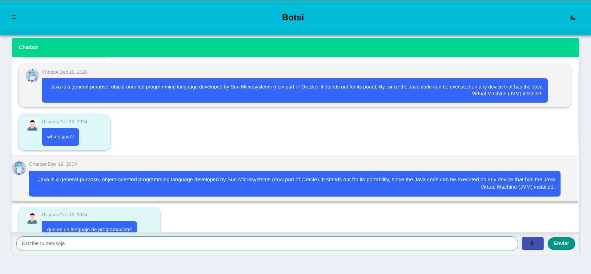
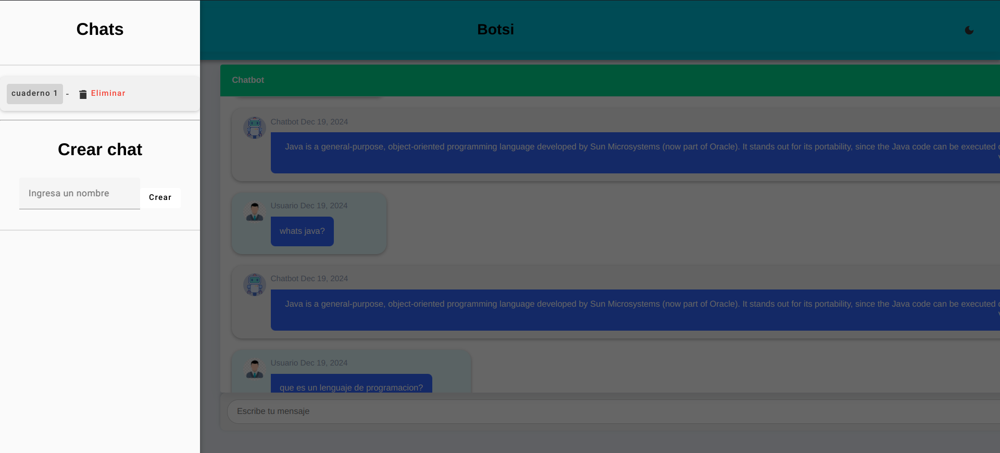
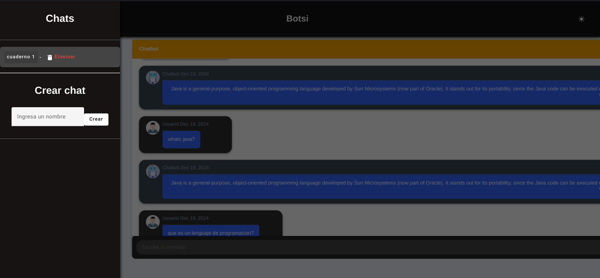
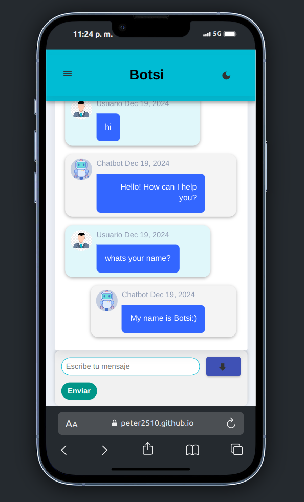
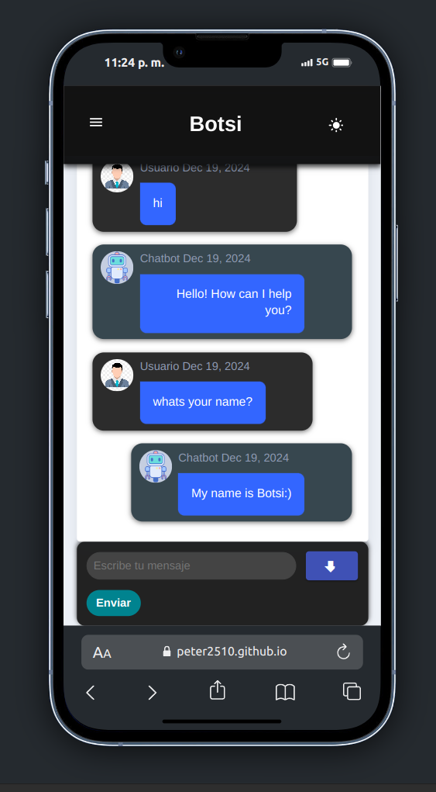

# IA1_Proyecto_10

## **Integrantes**

#### **Grupo 10**

- SUM COYOY, RANDY MARCELINO
- OVALLE DE LEÓN, CARLOS ALEXIS
- GORDILLO GONZÁLEZ , PEDRO RICARDO

## Detalles del proyecto

 Este es un modelo de inteligencia artificial desarrollado con **TensorFlow.js**, el cual se ejecuta directamente en el navegador utilizando el framework **Angular**. Esta combinación permite realizar interacción con el Chatbot de manera eficiente y dinámica, sin necesidad de enviar datos al servidor, mejorando así el rendimiento y la privacidad.

 Botsi es capaz de reponder a preguntas sobre inteligencia artificial, machine learning, lenguajes de programación (Java, JavaScript, Python, C++ y Go) tanto en inglés como español.

## Manual técnico
[Descargar Manual Técnico](./documentacion/manual-tecnico.pdf)

## Manual de usuario
[Descargar Manual de usuario](./documentacion/manual-usuario.pdf)

## Demostración

[Click aqui para la demostración](https://peter2510.github.io/IA1_Proyecto_10/)

# Ejemplo de entradas
- ¿Qué es un lenguaje de programación?
- que es un lenguaje de programación?
- ¿Qué es Machine Learning?
- ¿Qué es aprendizaje supervisado?
- What is Machine Learning?
- What is unsupervised learning?
- How does Google Maps use Machine Learning?

# Vista del Botsi

